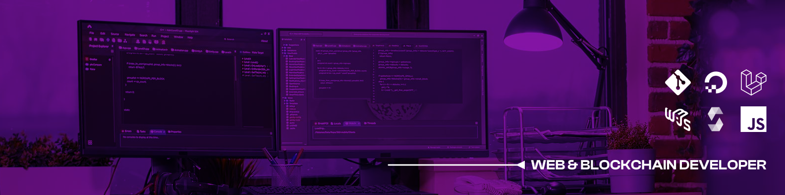

  
  
  
  

---

##  About Me

I have the drive to deliver exceptional results and always strive for a top-notch end-user experience. My commitment to continuous learning and growth fuels my passion for taking on new challenges and expanding my skill set. So, let's tackle some exciting projects and make some waves in the tech world together!

## 👨‍💻 Languages and Tools

With my expertise in the following languages and tools, I bring a wealth of knowledge and my love for innovation to every project I take on.

### 📋 Programming and Markup Languages

  
  
  
  
  
  
  
  

  
<b>🛠️ My Favorite Tools</b>

  <h4>🧰 Frameworks and Libraries</h4>
  

    
    
    
    
    
    
    
    
    
    
    
  

  <h4>🗄️ Databases and Cloud Hosting</h4>
  

    
    
    
    
    
    
    
    
    
  

  <h4>💻 Software and Tools</h4>
  

    
    
    
    
    
    
    
    
    
    
    
    
    
    
  

## 📈 Stats

|  |  |
| ------------- | ------------- |

  

